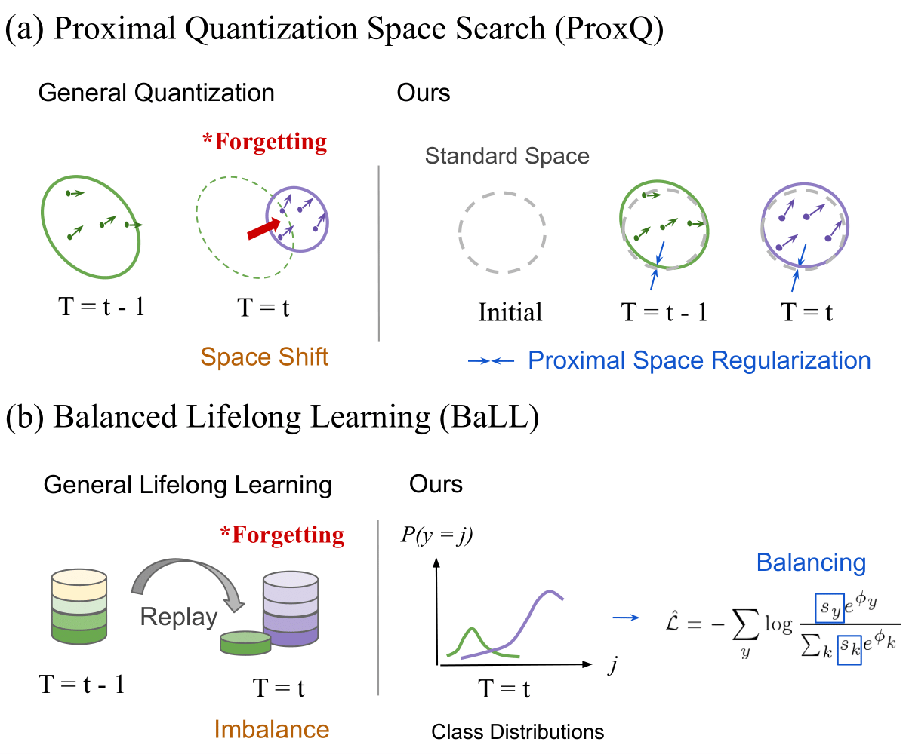

# Overcoming Forgetting Catastrophe in Quantization-Aware Training (LifeQuant)
ICCV 2023 Accepted Paper - Quantization, Efficient Inference, Lifelong Learning 



* **Motivations**:

- 1. to overcome quantization models forgetting the learned space on old task data 
- 2. to employ as few as replay data (old task data) for memory efficiency, but to avoid the forgetting the old tasks

* **Methods**:

- 1. **ProxQ**: to regularize the quantization space when learning new task data
- 2. **BaLL**: to strengthen the weighting of the few replay data (i.e., rebalancing)

## Requirements

* python3
* pytorch==1.7.1
* cudatoolkit==11.0.221 
* numpy==1.19.2
* tensorboardx==1.4

## Implementation

* e.g. 4-bit ResNet-20 on CIFAR-100-LL (gamma = 25).

### Data Preparation

* e.g. CIFAR-100.

```shell
cd src/
mkdir data_dir/
```

Save training (testing) image data to the path src/data_dir/cifar100/. (e.g. src/data_dir/cifar100/train/apple/0001.png)

### Data Generation - Lifelong Data

* e.g. CIFAR-10-LL (3 tasks with 25% classes forgot whenerver task switches).

##### 1. Generate lifelong data

```shell
cd lifelong_data_generation/
python3 lifeLongDataGeneator.py --data_dir "src/data_dir/cifar100/" --output_csv "cifar100.csv" --num_tasks 3 --diminish_rate 25 --source train
```

Files 'cifar100_train.csv', 'cifar100_train0.csv', 'cifar100_train1.csv', 'cifar100_train2.csv' is shown under src/cifar100_025.

* 'cifar100_train.csv': all training data
* 'cifar100_train$i$.csv': the i-th task of training data

##### 2. Move csv files

```shell
mv -r *.csv resnet-20-cifar-10/data/
```

**ps.** These two steps are neglibible since the csv files have been generated in the specific directories (see the next step).

### Training & Testing

* e.g. 4-bit ResNet-20 on CIFAR-10-LT (gamma = 10).

```shell
cd resnet-20-cifar-10/
```

Generated csv files are located under data/.

##### 1. Pretrain

Pretrain and save models to the path resnet-20-cifar-10/pretrained/.

##### 2. Quantize & Test

```shell
python3 main.py --csv_dir data/ --job_dir "experiment/ours/resnet/t_4bit_pre32bit" --method "ours" --source_dir "pretrained" --source_file "res20_32bit/model_best.pt" --arch resnet --bitW 4 --abitW 4 --target_model "resnet20_quant" --source_model "resnet20" --lt_gamma 10 --num_epochs 50 --train_batch_size 128 --eval_batch_size 100 --lr 0.04
```


## Citation

```shell
@inproceedings{
  chen2022climbq,
  title={ClimbQ: Class Imbalanced Quantization Enabling Robustness on Efficient Inferences},
  author={Ting-An Chen and Ming-Syan Chen},
  booktitle={Advances in Neural Information Processing Systems},
  editor={Alice H. Oh and Alekh Agarwal and Danielle Belgrave and Kyunghyun Cho},
  year={2022},
  url={https://openreview.net/forum?id=F7NQzsl334D}
}
```
